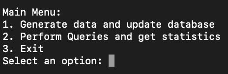
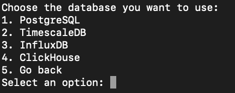

# CLI-Tool-Database-Comparison

A command-line interface (CLI) tool designed for inserting data into PostgreSQL, TimescaleDB, ClickHouse, or InfluxDB and measuring query performance.

## Table of Contents
- [Introduction](#introduction)
- [Features](#features)
- [Installation](#installation)
- [Usage](#usage)
- [Examples](#examples)
- [Contributing](#contributing)

## Introduction
`CLI-Tool-Database-Comparison` is a CLI tool that allows users to compare the performance of queries. It utilizes tools like `pgbench` and others to perform benchmarking and generate statistics on query performance.

## Features
- Easy-to-use command-line interface 
- Insertion of data into PostgreSQL, TimescaleDB, ClickHouse, or InfluxDB
- Generate detailed performance reports

## Installation
To install `CLI-Tool-Database-Comparison`, you can clone the repository and install the required dependencies using the following commands:
```bash
git clone
cd CLI-Tool-Database-Comparison
npm install
```

## Usage

To use `CLI-Tool-Database-Comparison`, you can run the following command:
```bash
node main.js
```

## Examples
Here are some examples of how to use `CLI-Tool-Database-Comparison`:

### Insert Data

To insert data into a database and update the database with the new data click on the 1st option.

### Generate Performance Report

To generate a performance report for a specific query click on the 2nd option.



Despite which one of the options you choose, you will be asked to select the database you want to use.



## Contributing

Contributions are welcome! Please feel free to submit a Pull Request or fork the repository and get started.